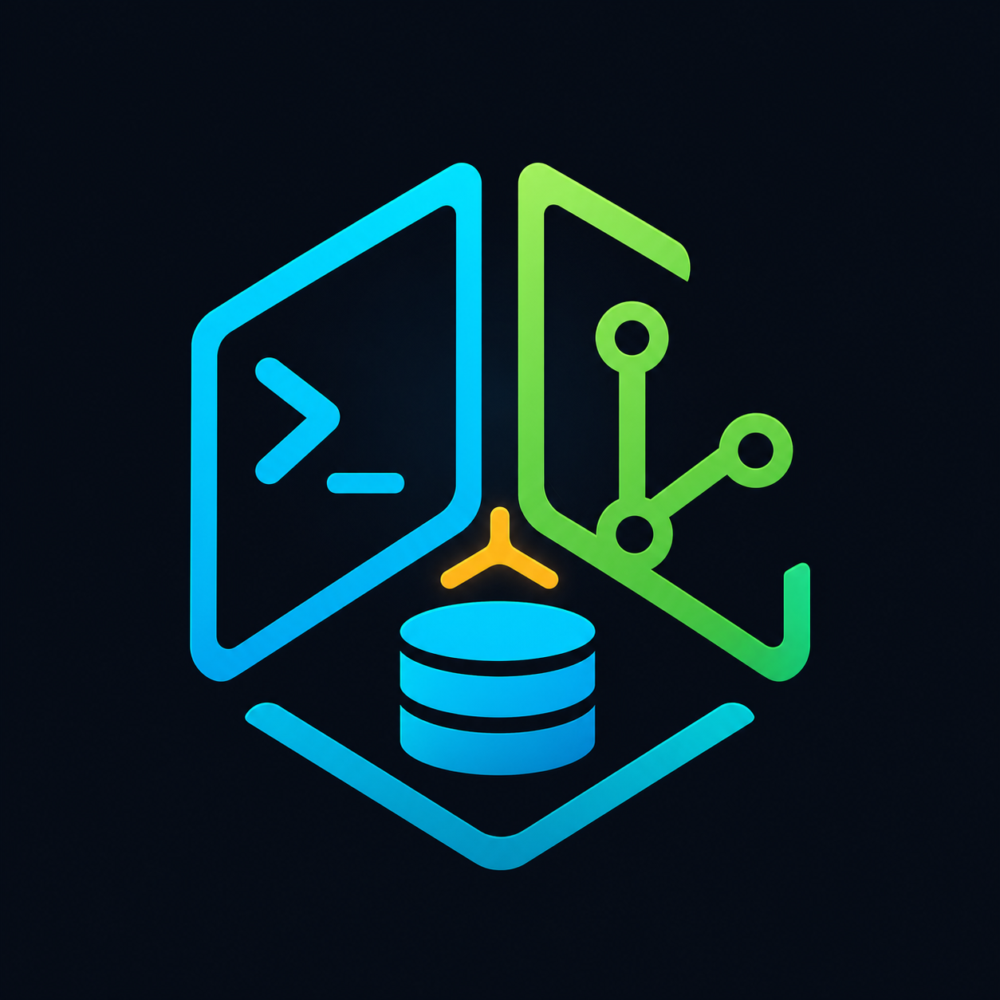

# Hety

<p align="center">
  
</p>

Hety is an all-in-one desktop developer cockpit for managing SSH sessions, Git repositories, and PostgreSQL databases from one project-based workspace.

Built with Electron, React, TypeScript, Vite, and Tailwind CSS.

## Features

- Project dashboard with groups, tags, search, and recent projects.
- Per-project SSH servers, Git repository paths, and PostgreSQL database connections.
- Multi-tab SSH terminals powered by xterm.js with password, key, and keyboard-interactive authentication.
- Remote tab for managing any saved SSH server without leaving the app:
  - **Files** — SFTP browser with breadcrumbs, upload (button or drag-and-drop), download (folders arrive as `.tar.gz`), rename, copy/move, delete, permissions and owner, compress/extract, an in-place text editor, an image preview, and a follow-the-tail log viewer. Right-click a row for per-file actions or empty space for folder actions.
  - **Monitor** — live CPU (total and per core), memory, swap, load, uptime, temperature, per-filesystem usage, network throughput, logged-in sessions, and a top-processes table with term/kill.
  - **Security** — ufw status with rule add/delete/enable/disable, listening ports (with one-click "allow in ufw"), an `sshd -T` hardening audit, fail2ban jails with unban, recent accepted/failed logins, and a pending-updates check.
  - **Services** — systemd units with start, stop, restart, enable/disable at boot, and `journalctl` output.
  - **Docker** — containers and images with start/stop/restart/remove, logs, and prune.

  Servers carry an optional **sudo password**; when the login account is not root, Hety uses it to elevate the actions that need it (firewall, services, root-owned files, uploads into protected directories) instead of making you run `sudo su` in a terminal.
- Git workspace tools for branch switching, fetch, pull, push, staging, unstaging, committing, and recent history.
- PostgreSQL schema browser for schemas, tables, views, enums, and columns.
- Multi-tab SQL console with CodeMirror autocomplete, saved queries, editable table views, and result export to Markdown, CSV, or TSV.
- Connection testing before saving SSH and database settings.
- Per-project **AI / Codex** tab with automatic Codex CLI detection, sign-in status, prompts, live activity and responses, and a Stop button.
  - Prompt without a working folder using **Hety tools only**, or optionally select a repository/local folder for code tasks.
  - Every prompt includes the current project's repositories, database/server metadata, tags, description, and planning cards. Preview or copy the exact resource context in the sidebar.
  - Codex can inspect saved SSH servers through Hety: deployment directories and files, process environments, systemd services, and Docker configuration. These are structured read-only inspections, with optional sudo using Hety's saved credentials.
  - Codex can inspect saved database schemas and run read-only analysis queries using Hety's saved credentials and SSH tunnels, without opening a database tab or selecting a working folder. For example: “Analyze the minimum, maximum, median and average submitted scores in the production database”. It inspects the schema and calculates aggregates over all matching rows. Query results go to Codex; saved connection passwords are not included in the project context.
  - Read-only AI analysis supports PostgreSQL, MySQL, MariaDB and ClickHouse, using database-enforced read-only transactions/settings and a restricted SELECT surface. SQL Server supports schema inspection and separately approved write queries. Custom functions, writes, locks and multiple statements are rejected by the read-only tool. Isolated AI connections never unlock the interactive database session. Queries have a 30-second driver limit and a 45-second operation deadline; at most 200 result rows/120 KB are returned, with truncation explicitly reported. Limits apply after aggregation. Stop cancels database operations and closes their tunnels.
  - Saved passwords, sudo passwords, private-key paths/passphrases, and server snippets are excluded from project metadata. SSH credentials stay inside Hety; requested remote configuration (including discovered database credentials) is returned to Codex.
  - Ask, for example, “Find the production database name, username and password on my production server”, then “Add it to this project”. Codex proposes a connection with its source; Hety shows an editable review card with masked password, SSH tunnel settings, and an optional connection test. Only **Add database** saves it. **Don’t add** or **Stop** leaves the list unchanged. New connections start with editing locked.
  - **Context & access** groups databases, servers and repositories into collapsible sections. Each resource has an inclusion checkbox and four modes: **Excluded** (hidden and blocked), **Read only** (inspection, no writes), **Approve changes** (review each write), and **Full access** (writes without confirmation). Each section includes Select all, Deselect all and a selector to change included resources together; large lists have search. Select all includes excluded resources as read-only and preserves modes for resources already included. New resources default to read-only. Planning columns support inclusion/exclusion as context only.
  - Full access shows a warning with the affected resources before enabling it, and a persistent warning in the section. Settings are saved per project and frozen for each run. Stop the current run before changing them. Access is enforced by the backend, including calls using guessed or previously known IDs. Excluded resources are omitted from prompts and `get_project`. Changing access also stops resending earlier chat messages, so previously disclosed resource results are not sent again. A database may still use an excluded server internally as its saved SSH tunnel; direct server inspection/commands remain blocked.
  - Write tools include `database_write` (including transactional PostgreSQL SQL batches), `ssh_execute` (optional sudo), `ssh_upload` (SFTP), `http_request` (POST/PUT/PATCH/DELETE), `http_upload` (multipart POST), `local_write`, and `local_execute`. Writes follow the target resource's mode. SFTP follows the server mode; HTTP requests/uploads have their own access setting. Approval remains single-use and tied to the run/window. Use an application API when business logic or cache invalidation matters. Failed or interrupted writes may partially apply; inspect before retrying. HTTP redirects are refused. Database writes use isolated connections and do not unlock the database tab. Adding a new database to Hety always requires review.
  - **Attach file** selects upload sources up to 25 MB each (20 files per chat). In approval mode the preview shows filename, size, SHA-256 hash and destination; changed sources are refused in all modes. SFTP uploads overwrite the exact destination. Local tools accept an included `repositoryId` without selecting a working folder, or use the chosen folder when omitted. Local file reads/writes refuse path/link escapes; changed existing files are refused while waiting for approval.
  - The Codex process always uses a read-only sandbox, with its local shell, inherited MCP servers, plugins, app connectors, browser/computer tools and hooks disabled for Hety runs. Permitted changes execute through Hety's access checks. Server and local execution commands can affect other systems reachable from that machine; the full-access warning makes this explicit. Without a folder, Hety uses a private scratch directory. Global Codex configuration is not modified.
  - Chat supports Markdown, fenced code blocks (including SQL), inline code, lists, links and tables. Code blocks preserve indentation and have a Copy button. Raw HTML is not executed.
  - Windows installations use the native Codex executable when available, with hidden subprocesses and cached installation checks.
  - Chat stays available when switching projects or tabs during this app session. **New chat** clears the conversation; recent messages are included with follow-up prompts. Codex uses its own authentication, model configuration, and local session storage.
- Encrypted local storage with AES-256-GCM and optional master password protection.

## Tech Stack

- Electron + electron-vite
- React 18 + TypeScript
- Tailwind CSS
- Zustand
- simple-git
- ssh2
- pg
- CodeMirror
- xterm.js

## Requirements

- Node.js 18 or newer
- Git available on `PATH` for repository features
- PostgreSQL access for database connections
- SSH access for remote terminal and tunnel features
- Optional AI tab: install Codex CLI (`npm install -g @openai/codex`) and sign in with `codex login`, then use **Check** in Hety. Hety detects Codex on `PATH` and the standard Windows npm install location; a desktop app installation alone may not provide the CLI.
- A Linux host for the Remote tab; privileged actions (firewall, services, some paths) need root or `sudo`

## Getting Started

Install dependencies:

```bash
npm install
```

Start the development app:

```bash
npm run dev
```

## Build

Type-check the main, preload, and renderer code:

```bash
npm run typecheck
```

Verify Codex integration (uses a local fake CLI, without contacting OpenAI):

```bash
npm run test:codex
```

For an opt-in test using your installed, signed-in Codex CLI:

```bash
node scripts/codex-smoke.cjs
```

This sends a synthetic analysis prompt to Codex and checks that it calls both Hety database tools. The database responses are fixtures; it never loads your vault or connects to a database/server. It consumes normal Codex usage.

After backend changes, fully quit and reopen Hety. In development, a refreshed chat interface can still be attached to an older Electron main process. The AI panel checks the backend tool manifest and blocks prompts with a restart notice when they do not match. Each run also shows when Codex has fetched the tool list; a run that never loads Hety's tools fails explicitly.

Build the app into `out`:

```bash
npm run build
```

Create a distributable package with electron-builder:

```bash
npm run pack
```

## Local Data

Hety stores its local app data in Electron's `userData` directory as `hety-data.dat`. When a master password is set, the data file is encrypted locally with AES-256-GCM.

## Project Structure

```text
src/main       Electron main process, IPC, local storage, SSH/Git/DB handlers
src/preload    Safe API bridge exposed to the renderer
src/renderer   React application, panels, dialogs, and UI components
src/shared     Shared TypeScript types
assets         Project images and branding assets
```

## GitHub Description

All-in-one desktop developer cockpit for SSH terminals, Git workflows, and PostgreSQL databases.

## License

MIT
